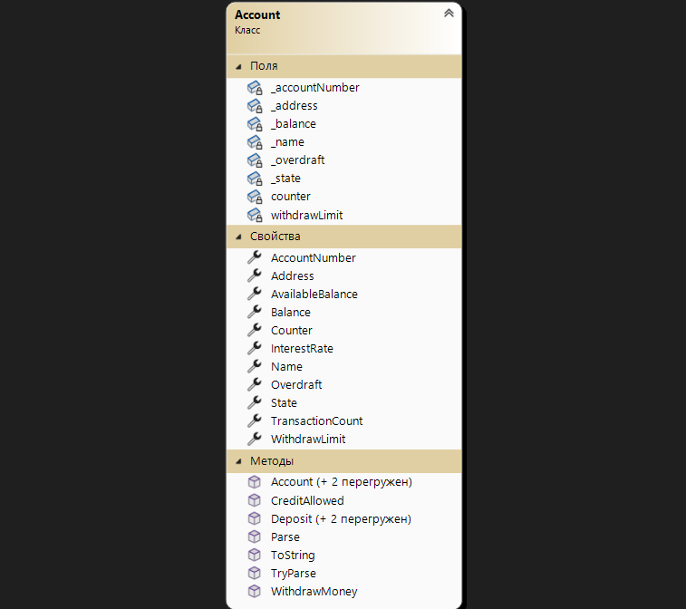
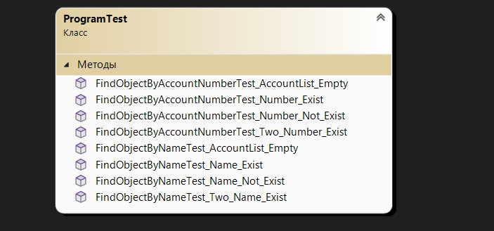

# Лабораторна робота №7
```mermaid
graph TD;
    A-->B
    A-->C
    B-->D
    C-->D

**З дисципліни:** "ООП"

**На тему:**
Saving and loading of objects.
Serialization/ Deserialization

## Постановка завдання

На основі отриманого на лекції 7 теоретичного матеріалу скорегувати програму для лабораторної роботи № 6 наступним чином:

1. В основній програмі додати методи для збереження (серіалізації) колекції List<Т> об’єктів предметної області у файли з форматом *.csv (*.txt) та *.json, а також методи для читання (десеріалізації) колекції з відповідних файлів.

    - Якщо у класі предметної області реалізований метод ToString() перетворює об’єкт на рядок, в якому всі значення розділенні комою, то обрати формат *.csv, інакше – *.txt. 

2. Модифікувати меню таким чином (з’являються нові пункти!):

    1 – додати об’єкт

    2 – вивести на екран об’єкти

    3 – знайти об’єкт

    4 – видалити об’єкт

    5 – демонстрація поведінки об’єктів

    6 – демонстрація роботи static методів

    7 – зберегти колекцію об’єктів у файлі

    8 – зчитати колекцію об’єктів з файлу

    9 – очистити колекцію об’єктів

    0 – вийти з програми

У пункті меню «7 – зберегти колекцію об’єктів у файлі» необхідно реалізувати підменю:
>1. – зберегти у файл *.csv (*.txt)
>2. – зберегти у файл *.json

У пункті меню «8 – зчитати колекцію об’єктів з файлу» необхідно реалізувати підменю:
>1. – зчитати з файлу *.csv (*.txt)
>2. – зчитати з файлу *.json

> Якщо на момент зчитування з файлу у колекції List<T> є наявні об’єкти, то десеріалізовані об’єкти мають додаватися до списку.
> До колекції List<T> об’єктів додаємо тільки коректно десеріалізовані об’єкти, інші – пропускаємо.

3. Для нових/перероблених методів додати/скорегувати unit-тести.

4. Запустити виконання всіх наявних unit-тестів (як нових, так і з попередньої лабораторної роботи) і досягти повного їх проходження.
5. Детально протестувати програму. Мають бути протестовані 7-9 пункти меню. При тестуванні десеріалізації перевіряємо процес перетворення не тільки на коректних файлах *.csv (*.txt) і *.json, а також не забуваємо перевірити і файли з пропущеними даними і невірними типами даних.

## Виконання роботи

#### Class diagram







#### Програмна реалізація класу

        using System.Text.Json.Serialization;

        namespace Lab_7
        {
            public class Account
            {
                // Характеристики класу
                private AccountState _state = new();
                private string? _name;
                private string? _address;
                private int _accountNumber;
                private double _balance;
                private short _overdraft;

                private static int counter;
                private static int withdrawLimit;

                public static int Counter
                {
                    get { return counter; }
                }

                public static int WithdrawLimit
                {
                    get { return withdrawLimit; }
                    set
                    {
                        if (value >= 0) withdrawLimit = value;
                        else withdrawLimit = 0;
                    }
                }

                [JsonPropertyName("Account state")]
                public AccountState State
                {
                    get { return _state; }
                    set { _state = value; }
                }

                public string Name
                {
                    get { return _name; }
                    set
                    {
                        if (!string.IsNullOrEmpty(value))
                            _name = value;
                        else
                            _name = "Unknown";
                    }
                }

                public string Address
                {
                    get { return _address; }
                    set
                    {
                        if (!string.IsNullOrEmpty(value))
                            _address = value;
                        else
                            _address = "Kharkiv";
                    }
                }

                [JsonPropertyName("Account Number")]
                public int AccountNumber
                {
                    get { return _accountNumber; }
                    set
                    {
                        if (value < 100000 || value > 999999)
                            _accountNumber = 123456;
                        else
                            _accountNumber = value;
                    }
                }

                public double Balance
                {
                    get { return _balance; }
                    set
                    {
                        if (value >= 0)
                            _balance = value;
                        else
                            _balance = 0;
                    }
                }

                public short Overdraft
                {
                    get { return _overdraft; }
                    set
                    {
                        if (value <= 0.25 * _balance)
                            _overdraft = value;
                        else
                            _overdraft = 0;
                    }
                }

                // Автовластивість, яка показує кількість транзакцій на рахунку
                [JsonIgnore]
                public int TransactionCount { get; set; } = 0;

                // Автовластивість, яка показує процентну ставку рахунку
                [JsonIgnore]
                public double InterestRate { get; private set; } = 10;

                // Обчислювальна властивість, розрахунок доступного залишку на рахунку
                [JsonIgnore]
                public double AvailableBalance
                {
                    get { return _balance + _overdraft; }
                }

                // Конструктор без параметрів
                public Account()
                {
                    counter++;
                }

                // Конструктор з параметрами
                public Account(AccountState state, string name, string address, int accountNumber, double balance, short overdraft)
                {
                    State = state;
                    Name = name;
                    Address = address;
                    AccountNumber = accountNumber;
                    Balance = balance;
                    Overdraft = overdraft;

                    counter++;
                }

                // Конструктор реалізований через виклик іншого власного конструктора
                public Account(AccountState state, string name, string address, double balance)
                    : this(state, name, address, 111111, balance, 0)
                {

                }

                // Метод поповнення балансу
                public void Deposit(int amount)
                {
                    if (amount > 0)
                        _balance += amount;
                }

                // Перевантажена версія методу поповнення балансу
                public void Deposit(double amount)
                {
                    if (amount > 0)
                        _balance += amount;
                }

                // Перевантажена версія методу поповнення балансу, з урахуванням комісії
                public void Deposit(int amount, int depositFee)
                {
                    if (amount > 0 && depositFee > 0)
                        _balance += amount - depositFee;
                }

                // Метод зняття грошей з балансу
                public bool WithdrawMoney(int amount)
                {
                    if (amount < 0)
                        return false;
                    if (_balance < amount || amount > WithdrawLimit)
                        return false;

                    _balance -= amount;
                    return true;
                }

                // Статичний метод, який вирішує, чи дозволено комусь оформити кредит
                public static bool CreditAllowed(int amount, int income, int age)
                {
                    if (amount <= income * 12 && age >= 18)
                        return true;
                    return false;
                }

                // Статичний метод який перетворює рядок у об’єкт класу Account
                public static Account Parse(string s)
                {
                    if (string.IsNullOrEmpty(s))
                        throw new ArgumentNullException("Рядок не може бути порожнiм");

                    string[] parts = s.Split(',');

                    if (parts.Length != 6)
                        throw new ArgumentException("Невiрний формат рядка!");

                    return new Account((AccountState)Enum.Parse(typeof(AccountState), parts[0]), parts[1],
                        parts[2], int.Parse(parts[3]), double.Parse(parts[4]), short.Parse(parts[5]));
                }

                // Статичний метод, який у разі можливості перетворює рядок у об’єкт класу Account
                public static bool TryParse(string s, out Account? account)
                {
                    account = null;
                    bool valid = false;

                    try
                    {
                        account = Parse(s);
                        valid = true;
                    }
                    catch (FormatException ex)
                    {
                        Console.WriteLine(ex.Message);
                    }
                    catch (ArgumentNullException ex)
                    {
                        Console.WriteLine(ex.Message);
                    }
                    catch (Exception ex)
                    {
                        Console.WriteLine(ex.Message);
                    }
                    return valid;
                }

                // Метод формування рядка з описом об'єкта
                public override string ToString()
                {
                    return $"{_state},{_name},{_address},{_accountNumber},{_balance:F0}," +
                        $"{_overdraft}";
                }
            }
        }

#### Програмна реалізація тест-класів

Тест-клас **AccountTest:**

        using Lab_7;

        namespace TestProject1
        {
            [TestClass]
            public class AccountTest
            {
                [TestMethod]
                public void DepositTest_amount_less_0()
                {
                    // Arrange
                    Account account = new()
                    {
                        Balance = 200
                    };
                    int amount = -100;

                    double expected = 200;

                    // Act
                    account.Deposit(amount);
                    double actual = account.Balance;

                    // Assert
                    Assert.AreEqual(expected, actual);
                }

                [TestMethod]
                public void DepositTest_amount_more_0()
                {
                    // Arrange
                    Account account = new()
                    {
                        Balance = 200
                    };
                    int amount = 100;

                    double expected = 300;

                    // Act
                    account.Deposit(amount);
                    double actual = account.Balance;

                    // Assert
                    Assert.AreEqual(expected, actual);
                }

                [TestMethod]
                public void Deposit2Test_amount_less_0()
                {
                    // Arrange
                    Account account = new()
                    {
                        Balance = 200
                    };
                    double amount = -100.5;

                    double expected = 200;

                    // Act
                    account.Deposit(amount);
                    double actual = account.Balance;

                    // Assert
                    Assert.AreEqual(expected, actual);
                }

                [TestMethod]
                public void Deposit2Test_amount_more_0()
                {
                    // Arrange
                    Account account = new()
                    {
                        Balance = 200
                    };
                    double amount = 100.5;

                    double expected = 300.5;

                    // Act
                    account.Deposit(amount);
                    double actual = account.Balance;

                    // Assert
                    Assert.AreEqual(expected, actual);
                }

                [TestMethod]
                public void Deposit3Test_amount_less_0()
                {
                    // Arrange
                    Account account = new()
                    {
                        Balance = 200
                    };
                    int amount = -50;
                    int depositFee = 20;

                    double expected = 200;

                    // Act
                    account.Deposit(amount, depositFee);
                    double actual = account.Balance;

                    // Assert
                    Assert.AreEqual(expected, actual);
                }

                [TestMethod]
                public void Deposit3Test_depositFee_less_0()
                {
                    // Arrange
                    Account account = new()
                    {
                        Balance = 200
                    };
                    int amount = 100;
                    int depositFee = -20;

                    double expected = 200;

                    // Act
                    account.Deposit(amount, depositFee);
                    double actual = account.Balance;

                    // Assert
                    Assert.AreEqual(expected, actual);
                }

                [TestMethod]
                public void Deposit3Test_amount_more_0_depositFee_more_0()
                {
                    // Arrange
                    Account account = new()
                    {
                        Balance = 200
                    };
                    int amount = 100;
                    int depositFee = 20;

                    double expected = 280;

                    // Act
                    account.Deposit(amount, depositFee);
                    double actual = account.Balance;

                    // Assert
                    Assert.AreEqual(expected, actual);
                }

                [TestMethod]
                public void WithdrawMoneyTest_amount_less_0()
                {
                    // Arrange
                    Account account = new()
                    {
                        Balance = 200
                    };
                    Account.WithdrawLimit = 1000;
                    int amount = -100;

                    // Act
                    bool actual = account.WithdrawMoney(amount);

                    // Assert
                    Assert.IsFalse(actual);
                }

                [TestMethod]
                public void WithdrawMoneyTest_amount_more_0_balance_deficient()
                {
                    // Arrange
                    Account account = new()
                    {
                        Balance = 200
                    };
                    Account.WithdrawLimit = 2000;
                    int amount = 1000;

                    // Act
                    bool actual = account.WithdrawMoney(amount);

                    // Assert
                    Assert.IsFalse(actual);
                }

                [TestMethod]
                public void WithdrawMoneyTest_amount_more_withdrawLimit()
                {
                    // Arrange
                    Account account = new()
                    {
                        Balance = 1000
                    };
                    Account.WithdrawLimit = 100;
                    int amount = 200;

                    // Act
                    bool actual = account.WithdrawMoney(amount);

                    // Assert
                    Assert.IsFalse(actual);
                }

                [TestMethod]
                public void WithdrawMoneyTest1_amount_more_0_balance_enough()
                {
                    // Arrange
                    Account account = new()
                    {
                        Balance = 100
                    };
                    Account.WithdrawLimit = 500;
                    int amount = 10;

                    // Act
                    bool actual = account.WithdrawMoney(amount);

                    // Assert
                    Assert.IsTrue(actual);
                }

                [TestMethod]
                public void WithdrawMoneyTest2_amount_more_0_balance_enough()
                {
                    // Arrange
                    Account account = new()
                    {
                        Balance = 100
                    };
                    Account.WithdrawLimit = 500;
                    int amount = 10;

                    double expected = 90;

                    // Act
                    account.WithdrawMoney(amount);
                    double actual = account.Balance;

                    // Assert
                    Assert.AreEqual(expected, actual);
                }

                [TestMethod]
                public void CreditAllowedTest_income_less_amount()
                {
                    // Arrange
                    int age = 20;
                    int amount = 1300;
                    int income = 100;

                    // Act
                    bool actual = Account.CreditAllowed(amount, income, age);

                    // Assert
                    Assert.IsFalse(actual);
                }

                [TestMethod]
                public void CreditAllowedTest_age_less_18()
                {
                    // Arrange
                    int age = 16;
                    int amount = 1000;
                    int income = 100;

                    // Act
                    bool actual = Account.CreditAllowed(amount, income, age);

                    // Assert
                    Assert.IsFalse(actual);
                }

                [TestMethod]
                public void CreditAllowedTest_income_more_amount_age_more_18()
                {
                    // Arrange
                    int age = 20;
                    int amount = 1000;
                    int income = 100;

                    // Act
                    bool actual = Account.CreditAllowed(amount, income, age);

                    // Assert
                    Assert.IsTrue(actual);
                }

                [TestMethod]
                public void ParseTest_throw_ArgumentNullException()
                {
                    // Arrange
                    string s = "";

                    // Act + Assert
                    Assert.ThrowsException<ArgumentNullException>(() => Account.Parse(s));
                }

                [TestMethod]
                public void ParseTest_throw_ArgumentException()
                {
                    // Arrange
                    string s = "Diana";

                    // Act + Assert
                    Assert.ThrowsException<ArgumentException>(() => Account.Parse(s));
                }

                [TestMethod]
                public void ParseTest_CorrectFormat()
                {
                    // Arrange
                    string s = "New,Diana,Kharkiv,123456,1000,100";

                    Account expected = new(AccountState.New, "Diana",
                        "Kharkiv", 123456, 1000, 100);

                    // Act
                    Account account = Account.Parse(s);

                    // Assert
                    Assert.AreEqual(expected.State, account.State);
                    Assert.AreEqual(expected.Name, account.Name);
                    Assert.AreEqual(expected.Address, account.Address);
                    Assert.AreEqual(expected.AccountNumber, account.AccountNumber);
                    Assert.AreEqual(expected.Balance, account.Balance);
                    Assert.AreEqual(expected.Overdraft, account.Overdraft);
                }

                [TestMethod]
                public void TryParseTest_string_empty()
                {
                    // Arrange
                    string s = "";
                    Account account;

                    // Act
                    bool actual = Account.TryParse(s, out account);

                    // Assert
                    Assert.IsFalse(actual);
                    Assert.IsNull(account);
                }

                [TestMethod]
                public void TryParseTest_string_incorrect_format()
                {
                    // Arrange
                    string s = "Diana";
                    Account account;

                    // Act
                    bool actual = Account.TryParse(s, out account);

                    // Assert
                    Assert.IsFalse(actual);
                    Assert.IsNull(account);
                }

                [TestMethod]
                public void TryParseTest_string_correct_format()
                {
                    // Arrange
                    string s = "New,Diana,Kharkiv,123456,1000,100";
                    Account account;

                    // Act
                    bool actual = Account.TryParse(s, out account);

                    // Assert
                    Assert.IsTrue(actual);
                    Assert.IsNotNull(account);
                }
            }
        }
    
Тест-клас **ProgramTest:**

        using Lab_7;
        using System.Collections.Generic;

        namespace TestProject1
        {
            [TestClass]
            public class ProgramTest
            {
                [TestMethod]
                public void FindObjectByNameTest_AccountList_Empty()
                {
                    // Arrange
                    List<Account> accounts = new();
                    string name = "Diana";

                    double expected = 0;

                    // Act
                    var actual = Program.FindObjectByName(accounts, name);

                    // Assert
                    Assert.AreEqual(expected, actual.Count);
                }

                [TestMethod]
                public void FindObjectByNameTest_Name_Not_Exist()
                {
                    // Arrange
                    List<Account> accounts = new();
                    Account account = new Account(AccountState.New, "Diana",
                        "Kharkiv", 123456, 1000, 100);

                    accounts.Add(account);
                    string name = "Frtqw";

                    double expected = 0;

                    // Act
                    var actual = Program.FindObjectByName(accounts, name);

                    // Assert
                    Assert.AreEqual(expected, actual.Count);
                }

                [TestMethod]
                public void FindObjectByNameTest_Name_Exist()
                {
                    // Arrange
                    List<Account> accounts = new();
                    Account account = new Account(AccountState.New, "Diana",
                        "Kharkiv", 123456, 1000, 100);

                    accounts.Add(account);
                    string name = "Diana";

                    double expected = 1;

                    // Act
                    var actual = Program.FindObjectByName(accounts, name);

                    // Assert
                    Assert.AreEqual(expected, actual.Count);
                    Assert.AreEqual(account, actual[0]);
                }

                [TestMethod]
                public void FindObjectByNameTest_Two_Name_Exist()
                {
                    // Arrange
                    List<Account> accounts = new();

                    Account account1 = new Account(AccountState.New, "Diana",
                        "Kharkiv", 123456, 1000, 100);
                    accounts.Add(account1);

                    Account account2 = new Account(AccountState.Active, "Diana",
                        "Kyiv", 777123, 2000, 200);
                    accounts.Add(account2);

                    string name = "Diana";

                    double expected = 2;

                    // Act
                    var actual = Program.FindObjectByName(accounts, name);

                    // Assert
                    Assert.AreEqual(expected, actual.Count);
                }

                [TestMethod]
                public void FindObjectByAccountNumberTest_AccountList_Empty()
                {
                    // Arrange
                    List<Account> accounts = new();
                    int accountNumber = 111111;

                    double expected = 0;

                    // Act
                    var actual = Program.FindObjectByAccountNumber(accounts, accountNumber);

                    // Assert
                    Assert.AreEqual(expected, actual.Count);
                }

                [TestMethod]
                public void FindObjectByAccountNumberTest_Number_Not_Exist()
                {
                    // Arrange
                    List<Account> accounts = new();
                    Account account = new Account(AccountState.New, "Diana",
                        "Kharkiv", 123456, 1000, 100);

                    accounts.Add(account);
                    int accountNumber = 111111;

                    double expected = 0;

                    // Act
                    var actual = Program.FindObjectByAccountNumber(accounts, accountNumber);

                    // Assert
                    Assert.AreEqual(expected, actual.Count);
                }

                [TestMethod]
                public void FindObjectByAccountNumberTest_Number_Exist()
                {
                    // Arrange
                    List<Account> accounts = new();
                    Account account = new Account(AccountState.New, "Diana",
                        "Kharkiv", 123456, 1000, 100);

                    accounts.Add(account);
                    int accountNumber = 123456;

                    double expected = 1;

                    // Act
                    var actual = Program.FindObjectByAccountNumber(accounts, accountNumber);

                    // Assert
                    Assert.AreEqual(expected, actual.Count);
                    Assert.AreEqual(account, actual[0]);
                }

                [TestMethod]
                public void FindObjectByAccountNumberTest_Two_Number_Exist()
                {
                    // Arrange
                    List<Account> accounts = new();

                    Account account1 = new Account(AccountState.Active, "Alex",
                        "Kharkiv", 123456, 500, 10);
                    accounts.Add(account1);

                    Account account2 = new Account(AccountState.New, "Diana",
                        "Kharkiv", 123456, 1000, 100);
                    accounts.Add(account2);

                    int accountNumber = 123456;

                    double expected = 2;

                    // Act
                    var actual = Program.FindObjectByAccountNumber(accounts, accountNumber);

                    // Assert
                    Assert.AreEqual(expected, actual.Count);
                }
            }
        }

#### Код програми

Вміст файлу **Program.cs:**

        namespace Lab_7
        {
            public class Program
            {
                static void Main()
                {
                    // Ініціалізація списку об'єктів класу Account
                    List<Account> accounts = new();

                    Random random = new();
                    int withdrawLimit = random.Next(500, 2000);
                    Account.WithdrawLimit = withdrawLimit;

                    bool restart = true;
                    while (restart)
                    {
                        Console.WriteLine(" 1 - Додати об'єкт\n 2 - Вивести об'єкти на екран\n" +
                            " 3 - Знайти об'єкт\n 4 - Видалити об'єкт\n 5 - Демонстрацiя поведiнки об'єктiв\n" +
                            " 6 – Демонстрацiя роботи static методiв\n 7 – Зберегти колекцiю об’єктiв у файл" +
                            "\n 8 - Зчитати колекцiю об’єктiв з файлу \n 9 - Очистити колекцiю об’єктiв\n" +
                            " 0 - Вийти з програми");
                        Console.Write("Виберiть пункт меню (0 - 9) --->");
                        int menu = int.Parse(Console.ReadLine());

                        switch (menu)
                        {
                            case 0:
                                restart = false;
                                break;

                            case 1:
                                AddObject(ref accounts);
                                break;

                            case 2:
                                if (accounts.Count == 0)
                                {
                                    Console.WriteLine("\nСписок порожнiй..\n");
                                    break;
                                }
                                else
                                {
                                    foreach (Account account in accounts)
                                    {
                                        Console.WriteLine(account.ToString() + "\n");
                                    }
                                }

                                Console.WriteLine($"--- Лiмiт для зняття грошей для усiх рахункiв = {Account.WithdrawLimit}");
                                Console.WriteLine($"--- Всього об'єктiв класу Account - {accounts.Count}\n");
                                break;

                            case 3:
                                Console.Write("За якою характеристикою ви хочете знайти об'єкт? (1 - Iм'я користувача, 2 - Номер рахунку) --->");
                                int type = int.Parse(Console.ReadLine());

                                switch (type)
                                {
                                    case 1:
                                        Console.Write("Введiть iм'я користувача ---> ");
                                        string? name = Console.ReadLine();
                                        var findObjByName = FindObjectByName(accounts, name!);

                                        if (findObjByName.Count == 0)
                                            Console.WriteLine("\nОб'єкт не знайдено");
                                        else
                                        {
                                            foreach (var account in findObjByName)
                                            {
                                                Console.WriteLine("\nЗнайдено наступний об'єкт:\n" + account.ToString());
                                            }
                                        }
                                        break;

                                    case 2:
                                        Console.Write("Введiть номер рахунку ---> ");
                                        int accountNumber = int.Parse(Console.ReadLine());
                                        var findObjById = FindObjectByAccountNumber(accounts, accountNumber);

                                        if (findObjById.Count == 0)
                                            Console.WriteLine("\nОб'єкт не знайдено");
                                        else
                                        {
                                            foreach (var account in findObjById)
                                            {
                                                Console.WriteLine("\nЗнайдено наступний об'єкт:\n" + account.ToString());
                                            }
                                        }
                                        break;

                                    default:
                                        Console.WriteLine("Помилка вводу!");
                                        break;
                                }
                                break;

                            case 4:
                                RemoveObject(ref accounts);
                                break;

                            case 5:
                                foreach (Account account in accounts)
                                {
                                    int deposit = random.Next(0, 2000);
                                    account.Deposit(deposit);
                                    Console.WriteLine($"Баланс поповнено успiшно на {deposit} гривень");
                                    account.TransactionCount++;

                                    int withdraw = random.Next(0, 1000);
                                    if (account.WithdrawMoney(withdraw))
                                    {
                                        Console.WriteLine($"Успiшно знято {withdraw} гривень");
                                        account.TransactionCount++;
                                    }
                                    else
                                        Console.WriteLine("Недостатньо грошей на балансi для зняття, або перевищено лiмiт!");

                                    Console.WriteLine("\n\t---Демонстрацiя роботи перевантажених методiв---");
                                    account.Deposit(deposit, 20);
                                    Console.WriteLine($"Баланс поповнено успiшно на {deposit - 20} гривень, з урахуванням комiсiї");
                                    account.TransactionCount++;

                                    double depositOverload = random.NextDouble() * 1000.0;
                                    account.Deposit(depositOverload);
                                    Console.WriteLine($"Баланс поповнено успiшно на {depositOverload:F1} гривень\n");
                                    account.TransactionCount++;
                                }
                                break;

                            case 6:
                                int age = random.Next(15, 25);
                                int income = random.Next(100, 1200);
                                int amount = random.Next(income) * 12;
                                if (Account.CreditAllowed(amount, income, age))
                                    Console.WriteLine($"\nМожна оформити кредит на суму: {amount}, з доходом {income} та вiком {age}");
                                else
                                    Console.WriteLine($"\nНеможливо оформити кредит на суму: {amount}, з доходом {income} та вiком {age}!");
                                break;

                            case 7:
                                Console.WriteLine("Оберiть формат файла, в який ви хочете зберегти колекцiю об'єктiв");
                                Console.WriteLine(" 1 - Зберегти у файл *.csv\n 2 - Зберегти у файл *.json");
                                int fileTypeToSave = int.Parse(Console.ReadLine());

                                switch (fileTypeToSave)
                                {
                                    case 1:
                                        SaveToFileCSV(accounts, "accounts.csv");
                                        break;

                                    case 2:
                                        SaveToFileJson(accounts, "accounts.json");
                                        break;
                                }
                                break;

                            case 8:
                                Console.WriteLine("Оберiть формат файла, з якого ви хочете зчитати колекцiю об'єктiв");
                                Console.WriteLine(" 1 - Зчитати з файлу *.csv\n 2 - Зчитати з файл *.json");
                                int fileTypeToRead = int.Parse(Console.ReadLine());

                                switch (fileTypeToRead)
                                {
                                    case 1:
                                        List<Account> accountsFromCSV = ReadFromFileCSV("accounts.csv");
                                        foreach (Account account in accountsFromCSV)
                                            accounts.Add(account);
                                        break;

                                    case 2:
                                        List<Account> accountsFromJson = ReadFromFileJson("accounts.json");
                                        foreach (Account account in accountsFromJson)
                                            accounts.Add(account);
                                        break;
                                }
                                break;

                            case 9:
                                accounts.Clear();
                                Console.WriteLine("\nКолекiя очищена!\n");
                                break;

                            default:
                                Console.WriteLine("Такого пункту меню не iснує\n");
                                break;
                        }
                    }
                }// Метод додавання об'єкту у список
                static void AddObject(ref List<Account> accounts)
                {
                    Console.Write("Як ви хочете ввести характеристики об'єкта?\n" +
                        "1 - Вводити по черзi, 2 - Ввести рядок з характеристиками --->");
                    int choice = int.Parse(Console.ReadLine());
                    switch (choice)
                    {
                        case 1:
                            Console.Write("\nЗа допомогою якого конструктора ви хочете створити об'єкт?\n" +
                            "(1 - Конструктор без параметрiв, 2 - Конструктор з параметрами," +
                            "\n3 - Конструктор реалiзований через виклик iншого власного конструктора) --->");
                            int typeOfConstructor = int.Parse(Console.ReadLine());

                            AccountState state = new();
                            try
                            {
                                Console.WriteLine("Input state --->");
                                state = (AccountState)Enum.Parse(typeof(AccountState), Console.ReadLine(), true);
                            }
                            catch (Exception e)
                            {
                                Console.WriteLine($"Помилка: {e.Message}. \n Встановлено значення за замовчуванням - New");
                            }

                            Console.WriteLine("Input name --->");
                            string name = Console.ReadLine();
                            Console.WriteLine("Input address --->");
                            string address = Console.ReadLine();
                            Console.WriteLine("Input account number --->");
                            int accountNumber = int.Parse(Console.ReadLine());
                            Console.WriteLine("Input balance --->");
                            double balance = double.Parse(Console.ReadLine());
                            Console.WriteLine("Input overdraft --->");
                            short overdraft = short.Parse(Console.ReadLine());

                            switch (typeOfConstructor)
                            {
                                case 1:
                                    Account account1 = new()
                                    {
                                        Name = name,
                                        Address = address,
                                        AccountNumber = accountNumber,
                                        Balance = balance,
                                        State = state,
                                        Overdraft = overdraft
                                    };
                                    accounts.Add(account1);

                                    Console.WriteLine("Об'єкт успiшно створено за допомогою конструктора без параметрiв.");
                                    break;

                                case 2:
                                    Account account2 = new(state, name, address, accountNumber, balance, overdraft);
                                    accounts.Add(account2);
                                    Console.WriteLine("Об'єкт успiшно створено за допомогою конструктора з параметрами.");
                                    break;

                                case 3:
                                    Account account3 = new(state, name, address, balance);
                                    accounts.Add(account3);
                                    Console.WriteLine("Об'єкт успiшно створено за допомогою конструктора, який реалiзован через виклик iншого.");
                                    break;
                            }

                            break;

                        case 2:
                            Console.WriteLine("\nВведiть характеристики об'єкта за прикладом:\n" +
                                "Стан рахунку, Iм'я користувача, Адреса, Номер рахунку, Баланс, Овердрафт");
                            string str = Console.ReadLine();

                            bool result = Account.TryParse(str, out Account account);
                            if (result)
                            {
                                accounts.Add(account);
                                Console.WriteLine("Об'єкт успiшно створено.");
                            }
                            break;

                        default:
                            Console.WriteLine("Помилка вводу!");
                            break;
                    }
                }

                // Метод пошуку об'єкта за ім'ям користувача
                public static List<Account> FindObjectByName(List<Account> accounts, string name)
                {
                    List<Account> findObjByName = accounts.FindAll(findObj => findObj.Name == name);

                    return findObjByName;
                }

                // Метод пошуку об'єкта за номером рахунку
                public static List<Account> FindObjectByAccountNumber(List<Account> accounts, int accountNumber)
                {
                    List<Account> findObjById = accounts.FindAll(findObj => findObj.AccountNumber == accountNumber);

                    return findObjById;
                }

                // Метод видалення об'єкту зі списку
                static void RemoveObject(ref List<Account> accounts)
                {
                    Console.Write("Як ви хочете видалити об'єкт? (1 - За номером об'єкта, 2 - За iм'ям користувача) --->");
                    int type = int.Parse(Console.ReadLine());
                    switch (type)
                    {
                        case 1:
                            Console.Write("Введiть номер об'єкта для видалення: ");
                            int numOfObj = int.Parse(Console.ReadLine());

                            try
                            {
                                accounts.RemoveAt(numOfObj);
                                Console.WriteLine($"Об'єкт пiд номером {numOfObj} видалено успiшно");
                            }
                            catch (Exception)
                            {
                                Console.WriteLine("Об'єкта пiд таким номером не iснує");
                            }

                            break;

                        case 2:
                            Console.Write("Введiть iм'я користувача ---> ");
                            string name = Console.ReadLine();

                            if (!accounts.Exists(p => p.Name == name))
                            {
                                Console.WriteLine("Об'єкта з таким iм'ям не iснує");
                                break;
                            }

                            accounts.RemoveAll(deleteObjByName => deleteObjByName.Name == name);
                            Console.WriteLine($"Об'єкт з iм'ям {name} видалено успiшно");
                            break;

                        default:
                            Console.WriteLine("Помилка вводу!");
                            break;
                    }
                }
        // Метод збереження списку об'єктів у файл *csv
                static void SaveToFileCSV(List<Account> accounts, string path)
                {
                    List<string> lines = new();
                    foreach (var item in accounts)
                    {
                        lines.Add(item.ToString());
                    }
                    try
                    {
                        File.WriteAllLines(path, lines);
                        Console.WriteLine($"Об'єкти збережно у: {Path.GetFullPath(path)}");
                    }
                    catch (Exception ex)
                    {
                        Console.WriteLine(ex.Message);
                    }
                }

                // Метод зчитування списку з файлу *csv
                static List<Account> ReadFromFileCSV(string path)
                {
                    List<Account> accounts = new();
                    try
                    {
                        List<string> lines = new();
                        lines = File.ReadAllLines(path).ToList();

                        Console.WriteLine("\nВмiст файлу CSV:\n");
                        foreach (var item in lines)
                        {
                            Console.WriteLine(item);
                            bool result = Account.TryParse(item, out Account? account);
                            if (result)
                                accounts.Add(account);
                        }
                    }
                    catch (IOException ex)
                    {
                        Console.WriteLine($"Помилка при читаннi з CSV файлу: {ex.Message}");
                    }
                    catch (Exception ex)
                    {
                        Console.WriteLine(ex.Message);
                    }
                    return accounts;
                }

                // Метод збереження списку об'єктів у файл *json
                static void SaveToFileJson(List<Account> accounts, string path)
                {
                    try
                    {
                        string jsonstring = "";
                        jsonstring = JsonSerializer.Serialize(accounts);
                        File.WriteAllText(path, jsonstring);
                        Console.WriteLine($"Об'єкти збережено у: {Path.GetFullPath(path)}");
                    }
                    catch (Exception ex)
                    {
                        Console.WriteLine(ex.Message);
                    }
                }

                // Метод зчитування списку з файлу *json
                static List<Account> ReadFromFileJson(string path)
                {
                    List<Account>? accounts = null;
                    try
                    {
                        accounts = JsonSerializer.Deserialize<List<Account>>(File.ReadAllText(path));
                    }
                    catch (IOException ex)
                    {
                        Console.WriteLine($"Помилка при читаннi з JSON файлу: {ex.Message}");
                    }
                    catch (Exception ex)
                    {
                        Console.WriteLine(ex.Message);
                    }
                    return accounts;
                }
            }
        }

#### Результати запуску unit-тестів


## ВИСНОВОК

>У ході виконання цієї лабораторної роботи я скорегувала програму для лабораторної роботи №6, додала у Program.cs методи для зчитування та збереження списку об’єктів класу Account у файли формату *json та *csv. Додала три нових пункти до меню: збереження колекції об’єктів у файл, зчитування колекції об’єктів з файлу та очищення колекції. Зробила діаграму класів у Visual Studio для основного проекту і тест-проектів, та детально протестувала нові пункти меню.